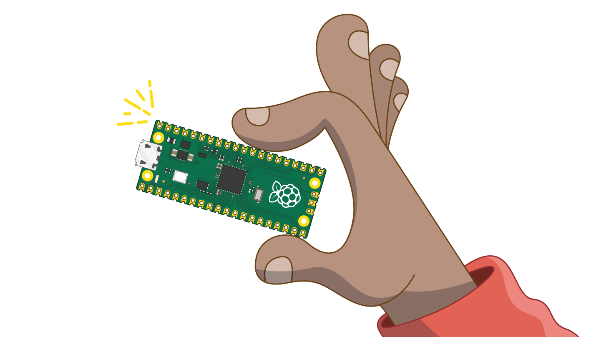

# getting-started-with-the

Find the project online at [projects.raspberrypi.org/en/projects/getting-started-with-the-pico](https://projects.raspberrypi.org/en/projects/getting-started-with-the-pico)

## Resources
For project materials and solutions, see [en/resources](https://github.com/raspberrypilearning/getting-started-with-the/tree/master/en/resources) and [en/solutions](https://github.com/raspberrypilearning/getting-started-with-the/tree/master/en/solutions).

## Contributing
See [CONTRIBUTING.md](CONTRIBUTING.md)

## Licence
 See [LICENCE.md](LICENCE.md)
