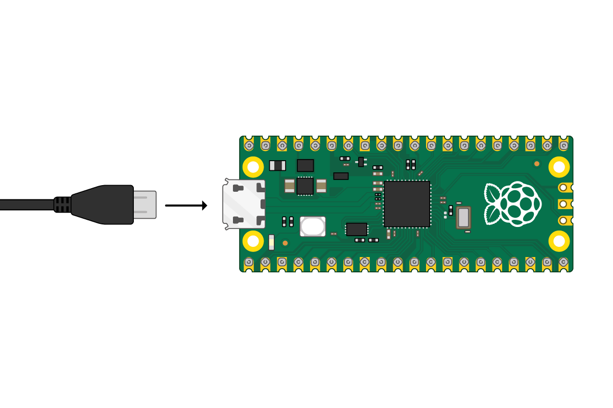
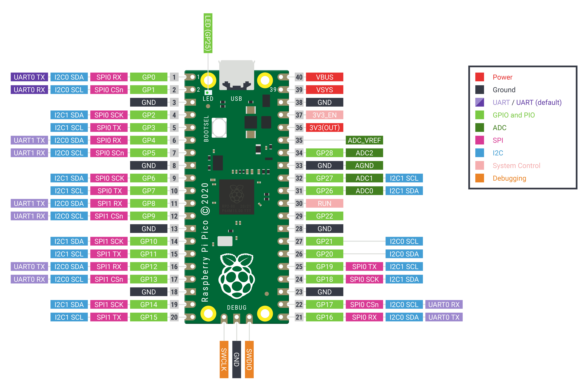

## Meet The Raspberry Pi Pico

This is the Raspberry Pi Pico. Hopefully your device has already had the header pins soldered on, but if not, you might like to have a look at our [Getting started with soldering resource](https://projects.raspberrypi.org/en/projects/getting-started-with-soldering).

--- task ---

If you have a breadboard, now would be a good time to place your Raspberry Pi Pico on to the board.
Place it so that the two headers are separated by the ravine in the middle.

--- /task ---

--- task ---
 
Plug your micro-USB cable into the port on the left side of the Pico.

--- /task ---

If you need to know the pin numbers for the Raspberry Pi Pico, you can refer to the following diagram.

