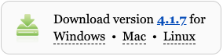

## Install or update Thonny

### Raspberry Pi OS

Thonny is already installed on Raspberry Pi OS, but may need to be updated to the latest version.

Open a terminal window, either by clicking the icon in the top left-hand corner of the screen or by pressing the Ctrl+Alt+T keys at the same time.

In the window, type the following to update your OS and Thonny.

```bash
sudo apt update && sudo apt upgrade -y
```

### Other operating systems

In a web browser, navigate to [thonny.org](https://thonny.org/){:target="_blank"}

In the top right-hand corner of the browser window, you will see download links for Windows and macOS, and instructions for Linux.

Download the relevant files and run them to install Thonny.



**Note**: Do not open Thonny yet.
