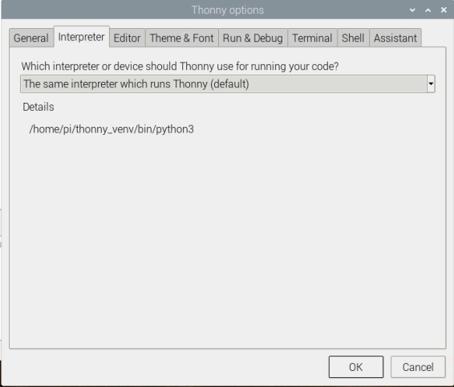
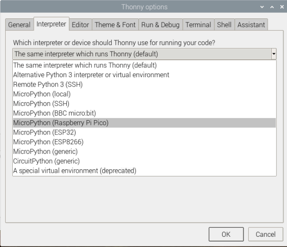

## Install Thonny or update Thonny

In this step you will install Thonny or make sure you have the latest version then you will connect to the Raspberry Pi X and run some simple Python code using the Shell. 

--- collapse ---
---

title: Thonny on the Raspberry Pi

---
- Thonny comes preinstalled on Raspberry Pi OS, but may need updating to the latest version.
- Open a terminal window, either by clicking the icon in the top left of the screen or by simultaneously pressing Ctrl+Alt+T.
- Type the following into the window, to update your OS and Thonny.

```bash
sudo apt update && sudo apt upgrade -y
```

--- /collapse ---

--- collapse ---
---

title: Install Thonny on other Operating Systems.

---
- On Windows, macOS and Linux, you can install the latest Thonny or update an existing version.
- In a web-browser, navigate to [thonny.org](https://thonny.org/).
- In the top right hand corner of the browser window, you will see download links for Windows and macOS, and instructions for Linux.
- Download the relevant files and run them to install Thonny.


--- /collapse ---

--- task ---

Open Thonny from your application launcher. It should look something like this


--- /task ---

--- task ---

You can use Thonny to write standard Python code. Try typing the following in the main window, and then clicking the run button (you will be asked to save the file).

```python3
print('Hello World!')
```

--- /task ---

In the bottom right hand corner of the Thonny window, you will see the version of Python, you are currently using. You can change this to use MicroPython for the Pico board.

--- task ---

Click on the Python version and choose *Configure interpreter...*


A new window should open up



--- /task ---

--- task ---

Choose "MicroPython (Raspberry Pi Pico)" from the drop down:



Click 'OK'.

--- /task ---

You're now ready to move on to the next step and connect your Pico board.
