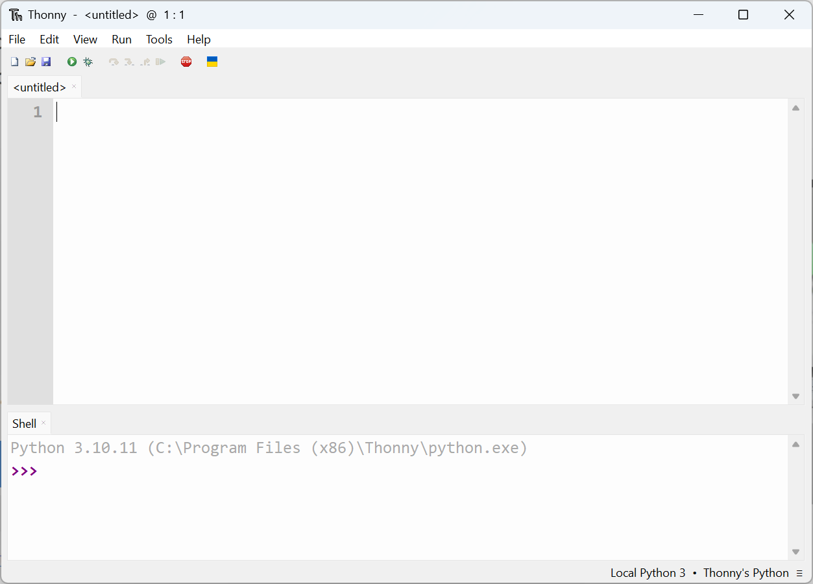

## Install Thonny or update Thonny

In this step, you will install Thonny or make sure you have the latest version. Then you will connect to a Raspberry Pi Pico and run some simple Python code using the Shell. 

--- collapse ---
---

title: Thonny on the Raspberry Pi

---
- Thonny is already installed on Raspberry Pi OS, but may need updating to the latest version
- Open a terminal window, either by clicking the icon in the top left-hand corner of the screen or by simultaneously pressing Ctrl+Alt+T
- Type the following into the window, to update your OS and Thonny

```bash
sudo apt update && sudo apt upgrade -y
```

--- /collapse ---

--- collapse ---

---

title: Install Thonny on other operating systems

---

- On Windows, macOS, and Linux, you can install the latest Thonny IDE or update an existing version
- In a web browser, navigate to [thonny.org](https://thonny.org/)
- In the top right-hand corner of the browser window, you will see download links for Windows and macOS, and instructions for Linux
- Download the relevant files and run them to install Thonny


--- /collapse ---

--- task ---

Open Thonny from your application launcher. It should look something like this



--- /task ---

--- task ---

You can use Thonny to write standard Python code. Try typing the following in the main window, and then clicking the **Run** button (you will be asked to save the file).

```python3
print('Hello World!')
```

--- /task ---

You're now ready to move on to the next step and connect your Raspberry Pi Pico.
