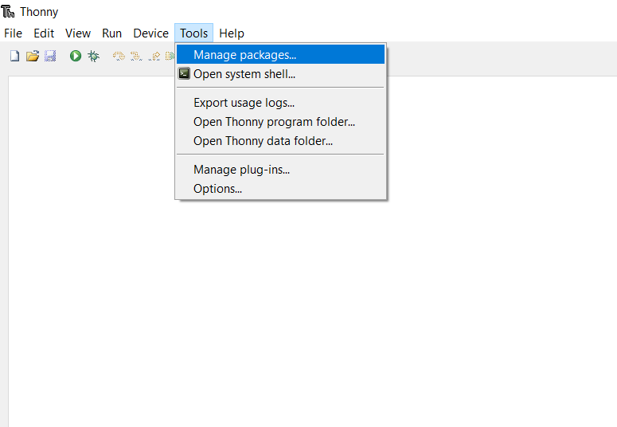

## Add the picozero package

--- task ---

From Thonny's 'Tools' menu, click 'Manage packages...'.

--- /task ---

--- task ---

Search for 'picozero', then install the package.

--- /task ---

**Note**: You only need to install picozero once.