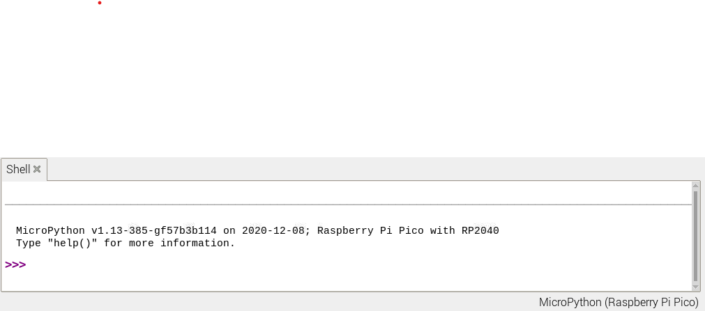

## Use the Shell

In this step you will run some simple Python code on your Raspberry Pi Pico using the Thonny Shell. 
--- task ---

Look at the 'Shell' panel at the bottom of the Thonny editor. 

You should see something like this:



Thonny will now be able to communicate with the Raspberry Pi Pico using the REPL (read–eval–print loop) which allows you to type in Python code into the Shell and see the output. 

--- /task ---

<mark>Will you be prompted if you have no firmware or out of date firmware?</mark>

--- task ---
Now you can type commands directly into the Shell and they will run on the Raspberry Pi Pico.

Type the following command:

``` python
print("Hello")
```
Tap Enter and you will see the output:


--- /task ---

--- task ---

MicroPython adds hardware-specific modules such as `machine` that you can use to program the Raspberry Pi Pico. 

You're going to create a `machine.Pin` object corresponding to the onboard LED which can be accessed using GPIO Pin 25. 

Setting the value of the led to `1` turns it on. 

Enter the following code, tapping Enter after each line:

``` python
from machine import Pin
led = Pin(25, Pin.OUT)
led.value(1)
```

You should see the onboard LED light up. 


Type the code to set the value to 0 to turn the LED off:

``` python
led.value(0)
```

Turn the LED on and off as many times as you like. 

Tip: You can use the up arrow on the keyboard to quickly access previous lines. 

--- /task ---

If you want to write a longer program then it's best to save it in a file which is what you will do in the next step.


