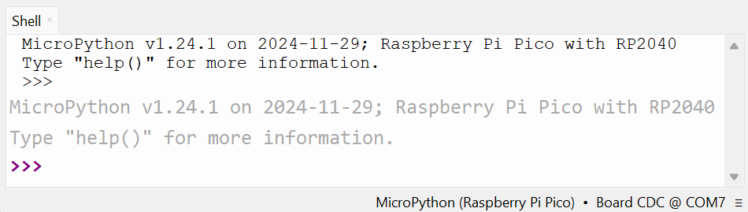
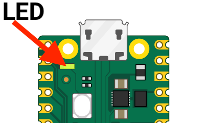

## Blink the onboard LED

Use the Thonny Shell to run some simple Python code on your Raspberry Pi Pico.

--- task ---

Make sure that your Raspberry Pi Pico is connected to your computer and you have selected the MicroPython (Raspberry Pi Pico) interpreter.

--- /task ---

--- task ---

Look at the Shell panel at the bottom of the Thonny editor. 

You should see something like this:



Enter this code in the Shell, making sure you tap Enter after each line.

``` python
from picozero import pico_led

pico_led.on()
```

You should see the onboard LED light up. 



--- /task ---

--- task ---

Type the code to turn the LED off.

``` python
pico_led.off()
```

--- /task ---

--- task ---

Turn the LED on and off as many times as you like. 

**Tip:** You can use the up arrow on the keyboard to quickly access previous lines. 

--- /task ---

If you want to write a longer program, then it's best to save it in a file. You'll do this in the next step.
