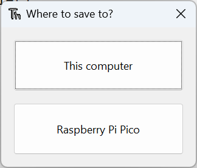

## Blink the onboard LED

The Shell is useful to make sure everything is working and try out quick commands. However, it's better to put longer programs in a file. 

Thonny can save and run MicroPython programs directly on the Raspberry Pi Pico.

In this step, you will create a MicroPython program to blink the onboard LED on and off in a loop. 

--- task ---

Click in the main editor pane of Thonny. 

Enter the following code to toggle the LED. 

``` python
from machine import Pin
led = Pin(25, Pin.OUT)

led.toggle()
```

--- /task ---

--- task ---

Click the **Run** button to run your code. 

Thonny will ask whether you want to save the file on 'This Computer' or the 'MicroPython Device'. Choose 'MicroPython Device'.



Enter `blink.py` as the file name. 

**Tip:** You need to enter the `.py` file extension so that Thonny recognises the file as a Python file. 

Thonny can save your program to your Raspberry Pi Pico and run it. 

You should see the onboard LED switch between on and off each time you click the **Run** button.

--- /task ---

--- task ---

You can use the `Timer` module to set a timer that runs a function at regular intervals. 

Update your code so it looks like this:

``` python
from machine import Pin, Timer
led = Pin(25, Pin.OUT)
timer = Timer()

def blink(timer):
    led.toggle()

timer.init(freq=2.5, mode=Timer.PERIODIC, callback=blink)
```

Click **Run** and your program will blink the LED on and off until you click the **Stop** button. 

--- /task ---

--- save ---
