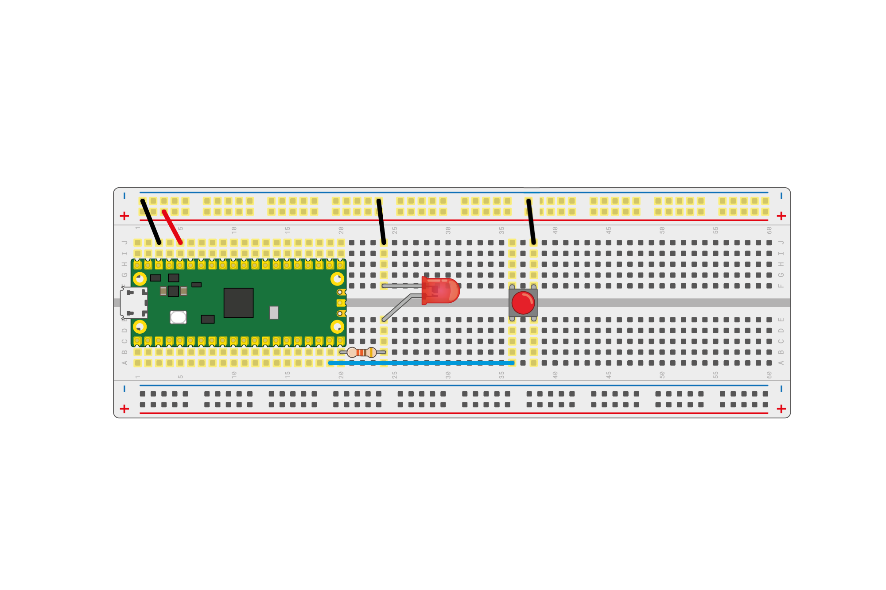

## Use digital inputs and outputs

Now you know the basics, you can learn to control an external LED with your Raspberry Pi Pico, and get it to read input from a button.

--- task ---

Use a resistor between about 50 and 330 ohms, an LED, and a pair of M-M jumper leads to connect up your Raspberry Pi Pico as shown in the image below.


--- /task ---

In this example, the LED is connected to pin 15. If you use a different pin, remember to look up the number in the pinout diagram in the [Meet Raspberry Pi Pico section](1.html).

--- task ---

Use the same code as you did to blink the onboard LED, but change the pin number to `15`.

```python
from machine import Pin, Timer
led = Pin(15, Pin.OUT)
timer = Timer()

def blink(timer):
    led.toggle()
	
timer.init(freq=2.5, mode=Timer.PERIODIC, callback=blink)
```

--- /task ---

Run your program and your LED should start to blink. If it's not working, check your wiring to be sure that the LED is connected.

Next, let's try and control the LED using a button.

--- task ---

Add a button to your circuit as shown in the diagram below.



--- /task ---

The button is on pin `14`, and is connected to the 3.3V pin on your Raspberry Pi Pico. This means when you set up the pin, you need to tell MicroPython that it is an input pin and needs to be *pulled down*.

--- task ---

Create a new file and add this code.

``` python
from machine import Pin
import time

led = Pin(15, Pin.OUT)
button = Pin(14, Pin.IN, Pin.PULL_DOWN)

while True:
    if button.value():
	    led.toggle()
        time.sleep(0.5)
```

--- /task ---

--- task ---

Run your code and then when you press the button, the LED should toggle on or off. If you hold the button down, it will flash.

--- /task ---

--- save ---
