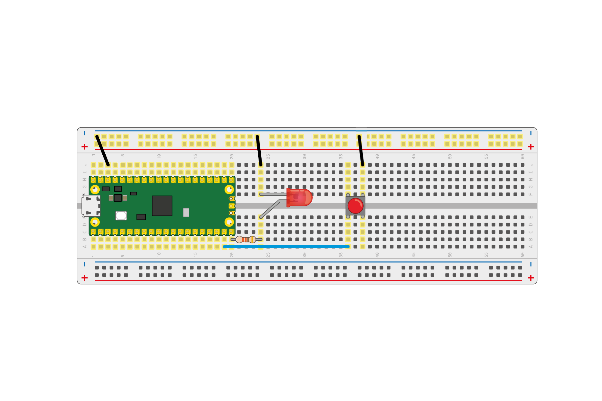

## Use digital inputs and outputs

Now you know the basics, you can control an external LED with your Raspberry Pi Pico, and get it to read input from a button.

--- task ---

Use a resistor between about 50 and 330 ohms, an LED, and a pair of pin-to-pin jumper leads to connect up your Raspberry Pi Pico on a breadboard, as shown in this image.


--- /task ---

In this example, the LED is connected to pin 15. If you use a different pin, remember to look up the number in the pinout diagram in the [Meet Raspberry Pi Pico](1) section.

--- task ---

Create a new file and add this code.

```python
from picozero import LED

led = LED(15)

while True:
    led.blink()
```

**Notice** you now `import LED` rather than `import pico_led`, as you want to control an LED connected to a GPIO pin.

--- /task ---

Run your program and your LED should start to blink. If it's not working, check your wiring to be sure that the LED is connected.

--- task ---

Stop your program.

--- /task ---

### Control the LED with a button

--- task ---

Add a button to your circuit as shown in this diagram.



--- /task ---

The button is connected to GPIO pin `14`.

--- task ---

Create a new file and add this code.

```python
from picozero import LED, Button

led = LED(15)
button = Button(14)

button.when_pressed = led.toggle
```

--- /task ---

--- task ---

**Run** your code. 

When you press the button, the LED should switch from on to off, (and from off to on!)turn on, if it is off and off if it is on. If you hold the button down, it will flash.

--- /task ---

--- task ---

Stop your program.

--- /task ---

--- save ---
