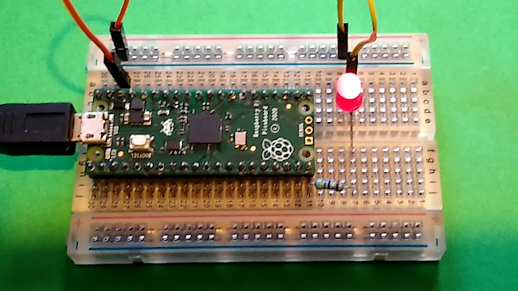

## Bevezetés

Ebben a részben megtanulhatotod, hogy hogyan lehet MicroPython alatt programozni egy Raspberry Pi Pico panel segítségével, ami egy másik számítógéphez van csatlakoztatva.

A Raspberry Pi Pico egy alacsony árfekvésű mikrokontroller. A mikrokontrollerek apró számítógépek, melyek nem rendelkeznek nagy mennyiségű tároló kapacitással és csatlakoztatható perifériákkal (például billentyűzetek vagy monitorok).

Hasonlóan a Raspberry Pi alaplapokhoz a Pico panel is rendelkezik GPIO csatlakozóval, ami azt jelenti, hogy számos elektronika alkatrészt vezérelhetsz vele vagy azokról adatokat fogadhatsz.

[**The new Introduction to Raspberry Pi Pico path**](https://projects.raspberrypi.org/en/pathways/pico-intro) [picozero](https://picozero.readthedocs.io/en/latest/) csomagot használja, amellyel kreatív fizikai számítástechnika (physical computing) projektekben vehetsz részt.

### Amit elkészíthetsz

Csatlakoztasd a Raspberry Pi Pico alaplapot a számítógépedhez. Telepítsd a Thonny Python IDE-t, és írj egy MicroPython programot, hogy villogni kezdjen az alaplapon lévő LED. Ha további eszközök is rendelkezésede állnak, akkor több más példát is kipróbálhatsz.

\--- no-print ---

\--- /no-print ---

\--- print-only ---

\--- /print-only ---

## --- collapse ---

## cím: Amire szükséged lesz

### Hardver

- Tüskesorral egybeforrasztott Raspberry Pi Pico alaplap
- Egy számítógép, amelyen fut a Thonny IDE és tudod programozni a Raspberry Pi Pico-t
- Mikro USB (adat + táp) kábel
- Elektronikai alkatrészek mint, például nyomógombok, LED-ek, megfelelő ellenállások, esetleg potenciométerek
- Próbapanel, papa-papa jumper kábelek további alkatrészek csatlakoztatásához (opcionális)
- Külső 5 V-os micro USB táp (opcionális)

### Szoftver

A projekt segítségével a következőket fogod telepíteni:

- MicroPython firmware a Raspberry Pi Pico-hoz
- Thonny Python IDE

\--- /collapse ---

## --- collapse ---

## cím: Amit megtanulhatsz

- Hogyan telepítheted a MicroPython firmware-t a Raspberry Pi Pico-ra
- Hogyan tudod programozni a Raspberry Pi Picot MicroPython segítségével
- Hogyan csatlakoztathatsz további alkatrészeket a Raspberry Pi Pico-hoz, és hogyan tudsz MicroPython programokat írni, hogy ezek az alkatrészek működjenek

\--- /összecsukás---

## --- collapse ---

## cím: További információk oktatóknak

Ha ezt a projektet egy iskolában vagy más felügyelt hálózattal rendelkező környezetben hajtod végre, akkor győződj meg róla, hogy rendelkezel a megfelelő engedélyekkel az USB-meghajtó csatlakoztatásához és a szoftver telepítéséhez.

Ha ki szeretnéd nyomtatnia ezt a projektet, használd a [nyomtatóbarát verziót](https://projects.raspberrypi.org/en/projects/getting-started-with-the-pico/print){:target="_blank "}.

[Itt található egy link a projektben található komplett programkódokhoz] (https://rpf.io/p/en/getting-started-with-the-pico-get).

\--- /collapse ---
