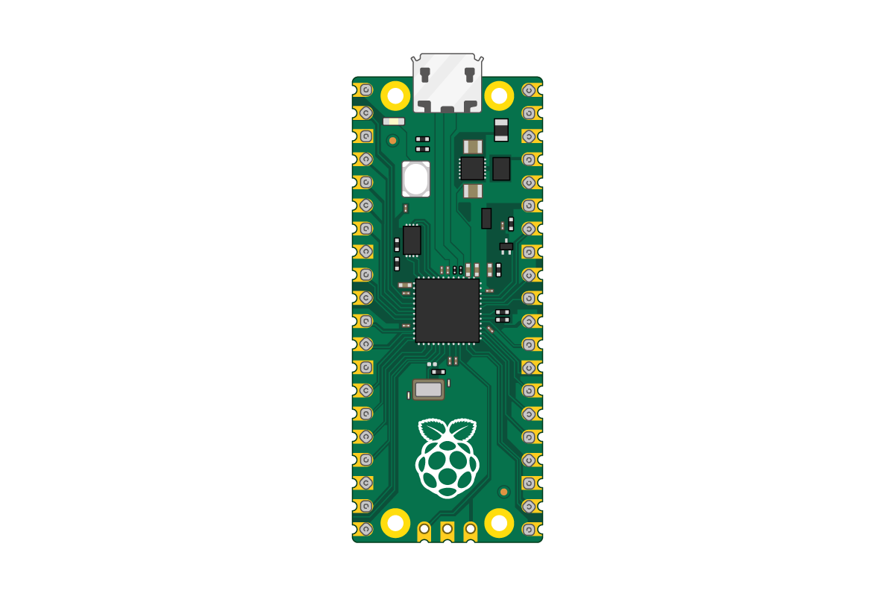

## Ismerd meg a Raspberry Pi Pico-t

Ez egy Raspberry Pi Pico. Remélhetőleg az alaplapra már előre fel van forrasztva egy csatlakozó, de ha nem, akkor érdemes lehet megnézni [Kezdő lépések a forrasztással című segédanyagunkat] (https://projects.raspberrypi.org/en/projects/getting-started -forrasztással).

\--- task ---

Ha van próbapaneled, tedd rá a Raspberry Pi Pico-t.

Úgy helyezd el, hogy a tüskesorok a panelfelező mélyedés két átellenes oldalára kerüljenek.

\--- /task ---

\--- task ---

Csatlakoztasd a micro-USB kábelt az alaplap bal oldalán található porthoz.

\--- /task ---

Ha tudni szeretnéd a Raspberry Pi Pico lábkiosztását, nézd meg a következő ábrát.

