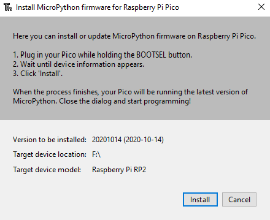
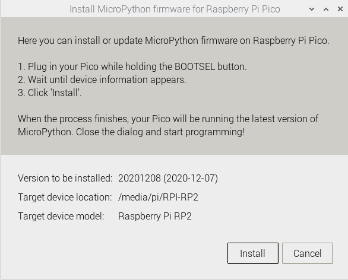

## MicroPython firmware hozzáadása

Ha még soha nem használtad a MicroPython-t Raspberry Pi Pico-n, akkor hozzá kell adnod a MicroPython firmware-t.

\--- task ---

Keresd meg a BOOTSEL gombot a Raspberry Pi Pico-n.

Nyomd meg és tartsd lenyomva a BOOTSEL gombot, amíg a mikro-USB-kábel másik végét csatlakoztatod a számítógéphez. Az alábbi képen egy Raspberry Pi látható, de ugyanez vonatkozik minden számítógépre.

Ezzel a Raspberry Pi Pico USB-háttértár módba kerül.

\--- /task ---

\--- task ---

A Thonny ablak jobb alsó sarkában láthatod a Python jelenleg használt verzióját.

Kattints a Python verzióra, és válaszd a „MicroPython (Raspberry Pi Pico)” lehetőséget:

Ha nem látod ezt a lehetőséget, akkor ellenőrizd, hogy csatlakoztatva van-e a Raspberry Pi Pico.

\--- /task ---

\--- task ---

Ezt követően egy párbeszédpanel ugril fel a MicroPython firmware legújabb verziójának Raspberry Pi Pico alaplapra történő telepítéséhez.

Kattints az **Install / Telepítés** gombra, hogy átmásold a firmware-t a Raspberry Pi Pico alaplapra.

Várd meg, amíg a telepítés befejeződik, majd kattints a **Close/ Bezárás** gombra.

\--- /task ---

\--- collapse ---

---&#x20;

cím: Firmware telepítésmenü

---

A firmware-telepítési menüt az állapotsorban a „MicroPython (Raspberry Pi Pico)” elemre kattinva is elérheted, és válaszd ki az „Configuer interpreter…” lehetőséget.

Megnyílik az interpreter beállítása.

Kattints az **Install or update firmware / Firmware telepítése vagy frissítése** lehetőségre.

Miközben lenyomva tartod a BOOTSEL gombot, a rendszer kéri, hogy csatlakoztasd a Raspberry Pi Pico-t.

Ezután kattints a **Install / Telepítés** gombra.

Várd meg, amíg a telepítés befejeződik, majd kattints a **Close/ Bezárás** gombra.

\--- /collapse ---

A Raspberry Pi Pico használatakor nem kell minden alkalommal frissítened a firmware-t. Legközelebb egyszerűen csatlakoztathatod a számítógéphez a BOOTSEL gomb megnyomása nélkül.
