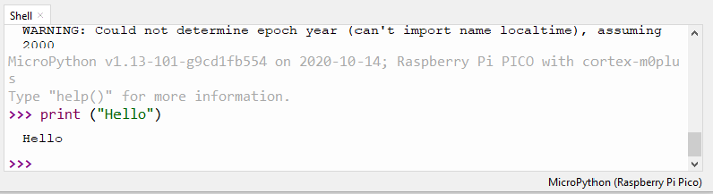

## Shell használata

Ebben a részben megtudhatot, hogy hogyan futtathatsz néhány egyszerű Python programot a Raspberry Pi Pico alaplapon a Thonny Shell segítségével.

--- task ---

Győződj meg róla, hogy a Raspberry Pi Pico csatlakozik a számítógépedhez, és a MicroPython (Raspberry Pi Pico) interpreter programot választottad ki.

--- /task ---

--- task ---

Nézd meg a Shell panelt a Thonny szerkesztő alján.

Valami hasonlót kellene látnod:


Thonny mostantól képes kommunikálni a Raspberry Pi Pico-val a REPL (read-eval-print loop) használatával. Most már beírhatod a Python-kódot a Shell-be, és megnézheted a kimenetet.

--- /task ---

--- task ---

Most már közvetlenül beírhatod a parancsokat a Shell-be, és ezek futni fognak a Raspberry Pi Pico-n.

Gépeld be a következő parancsot.

```python
print("Hello")
```

Nyomj egy Entert és látni fogod a kimenetet:



--- /task ---

--- task ---

A MicroPython olyan hardver-specifikus modulokat ad hozzá, mint például a `machine`, amelyek segítségével programozhatod a Raspberry Pi Pico-t.

Hozzunk létre egy `machine.Pin` objektumot, hogy hozzáférhessünk az alaplapon lévő LED-hez, amely a 25-ös GPIO kimenet segítségével érhető el.

Ha a LED értéket `1`-re állítod be akkor az világítani fog.

Írd be a következő kódot, ne feledd, hogy minden sor után feltétlenül nyomj egy Entert.

```python
from machine import Pin
led = Pin(25, Pin.OUT)
led.value(1)
```

Az alaplapon lévő LED bekapcsol.


A LED kikapcsolásához írd be a program kódot, és az értékhez írj '0'-t.

```python
led.value(0)
```

Kapcsold ki/be a LED-et, ahányszor csak akarod.

**Tipp:** Az előző sorok gyors eléréséhez használhatod a billentyűzet felfelé mutató nyilát.

--- /task ---

Ha hosszabb programot szeretnél írni, akkor a legjobb, ha elmented egy fájlba. Ezt fogjuk megtenni a következő lépésben.
