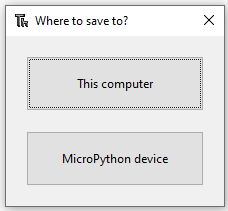

## Panelen lévő LED villogtatása

A Shell nagyon hasznos a működés ellenőrzéséhez és parancsok élesben történő kipróbálásához. A hosszabb programokat azonban jobb fájlba menteni.

A Thonny közvetlenül a Raspberry Pi Pico-ra tudja menteni és futtatni a MicroPython programokat.

Ebben a lépésben egy MicroPython programot írhatsz, amely villogtatja az alaplapon lévő LED-et.

--- task ---

Kattints a Thonny fő szerkesztőpaneljére.

Írd be a következő kódot a LED ki/be kapcsolásához.

```python
from machine import Pin
led = Pin(25, Pin.OUT)

led.toggle()
```

--- /task ---

--- task ---

A program futtatásához kattints a **Run** gombra.

Thonny megkérdezi, hogy **Erre a számítógépre** vagy a **MicroPython-eszközre** szeretnéd menteni a fájlt. Válaszd a **MicroPython eszköz** lehetőséget.



Fájlnévként a `blink.py`-t add meg.

**Tipp:** Meg kell adnod a `.py` fájlkiterjesztést, hogy azt a Thonny Python fájlként ismerje fel.

Thonny a Raspberry Pi Pico-ra menti a programot, és futtathatja azt.

Valahányszor a **Run/Futtatás** gombra kattintassz, látod ahogy a LED ki- és bekapcsol az alaplapon.

--- /task ---

--- task ---

Az `Timer/Időzítő` modul segítségével beállíthatsz egy időzítőt, amely rendszeres időközönként futtat egy funkciót.

Frissítse a kódot, hogy így nézzen ki:

```python
from machine import Pin, Timer
led = Pin(25, Pin.OUT)
timer = Timer()

def blink(timer):
    led.toggle()

timer.init(freq=2.5, mode=Timer.PERIODIC, callback=blink)
```

Kattints **Run/Futtatás** gombra, és a program addig villogtatja a LED-et, amíg a **Stop** gombra nem kattintasz.

--- /task ---

--- save ---
