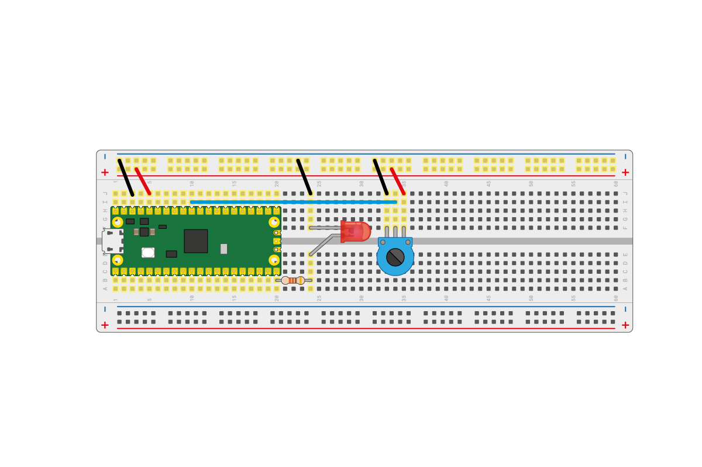

## LED vezérlése analóg bemenettel

A Raspberry Pi Pico rendelkezik analóg jelek fogadására képes bemenetekkel. Ez azt jelenti, hogy nemcsak az „1” és „0” (be és ki) állapotoka ismeri, hanem a közöttük lévő értékeket is képes beolvasni.

A potenciométer egy tökéletes analóg eszköz ehhez a feladathoz.

--- task ---

Cseréld ki az áramkör nyomógombját egy potenciométerre. A lenti ábra szerint kösd be a potenciamétert az analóg bemenetre.



--- /task ---

--- task ---

A Thonny alatt egy új file-ban először olvasd ki a potenciométer értékét.

Add hozzá ezt a kódot egy új fájlhoz, majd futtasd.

```python
from machine import ADC, Pin
import time

adc = ADC(Pin(26))

while True:
    print(adc.read_u16())
    time.sleep(1)
```

A maximális és minimális érték megtekintéséhez forgasd el a potenciométert.

Körülbelül `0` és `65025` között kellene lenniük.

--- /task ---

--- task ---

Most már használhatod ezt az értéket a LED-en a PWM munkaciklusának vezérlésére.

Módosítsd a programot a következőre. Miután futtattad, a potenciométer gombjának tekergetésével szabályozhatod a LED fényerejét.

```python
from machine import Pin, PWM, ADC

pwm = PWM(Pin(15))
adc = ADC(Pin(26))

pwm.freq(1000)

while True:
	duty = adc.read_u16()
	pwm.duty_u16(duty)
```

--- /task ---

--- save ---
