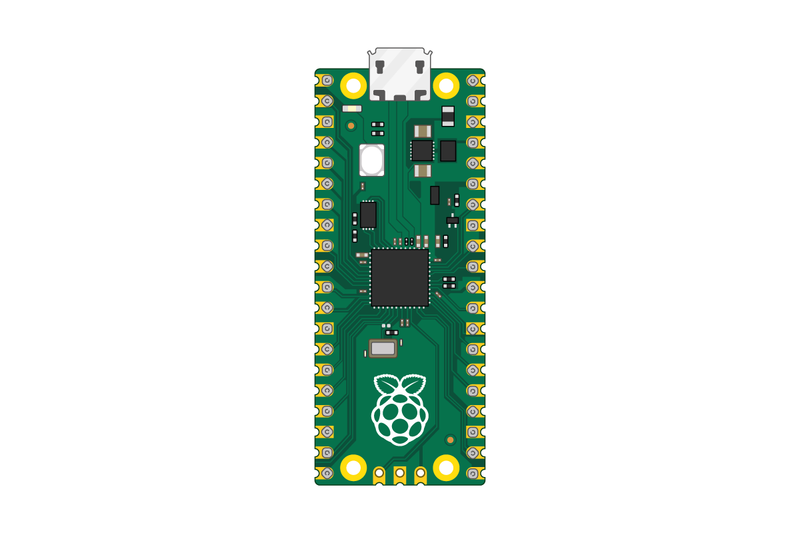

## Meet Raspberry Pi Pico

This is a Raspberry Pi Pico. Hopefully your device has already had the header pins soldered on, but if not, you might like to have a look at our [Getting started with soldering resource](https://projects.raspberrypi.org/en/projects/getting-started-with-soldering).

\--- task ---

If you have a breadboard, put your Raspberry Pi Pico on the board.

Place it so that the two headers are separated by the ravine in the middle.

\--- /task ---

\--- task ---

Plug your micro USB cable into the port on the left-hand side of the board.

\--- /task ---

If you need to know the pin numbers for a Raspberry Pi Pico, you can refer to the following diagram.

