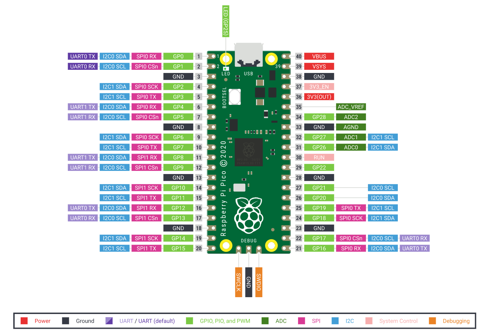

## Möt Raspberry Pi Pico

Detta är en Raspberry Pi Pico. Förhoppningsvis har din enhet redan haft huvudstiften fastlödda, men om inte, kanske du vill ta en titt på vår [Komma igång med lödningsresurs](https://projects.raspberrypi.org/en/projects/getting-started-med-lödning).

\--- task ---

Om du har en breadboard, lägg din Raspberry Pi Pico på den.

Placera den så att de två stiftsraderna är åtskilda av urgröpningen i mitten.

\--- /task ---

\--- task ---

Anslut din mikro-USB-kabel till porten på kortets vänstra sida.

\--- /task ---

Om du behöver veta pinnumren för en Raspberry Pi Pico kan du titta på följande diagram.

