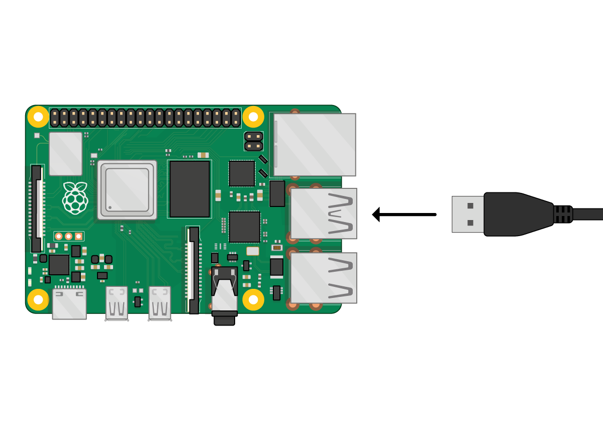
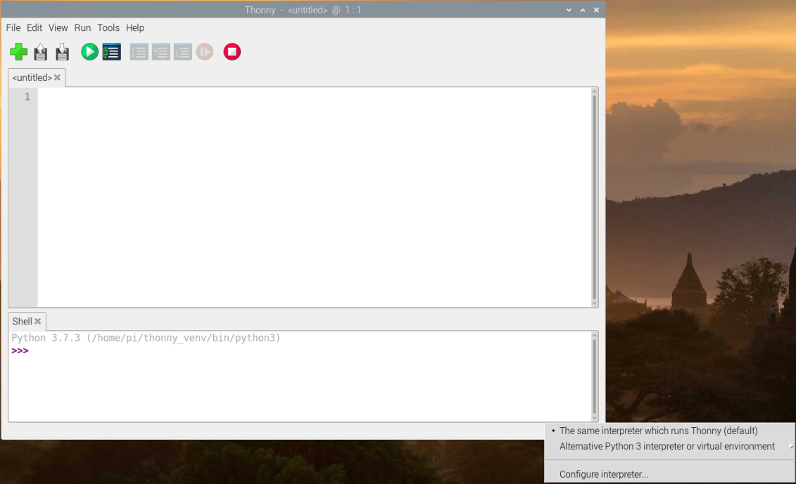

## Lägg till MicroPython-firmware

Om du aldrig har använt MicroPython på din Raspberry Pi Pico, måste du lägga till MicroPython-firmware.

\--- task ---

Hitta BOOTSEL-knappen på din Raspberry Pi Pico.

Tryck på BOOTSEL-knappen och håll den nedtryckt medan du ansluter den andra änden av mikro-USB-kabeln till din dator. En Raspberry Pi visas på bilden nedan, men detsamma gäller för vilken dator som helst.

Detta sätter din Raspberry Pi Pico i USB-masslagringsenhetsläge.

\--- /task ---

\--- task ---

I det nedre högra hörnet av Thonny-fönstret ser du den version av Python som du använder för närvarande.

Klicka på Python-versionen och välj "MicroPython (Raspberry Pi Pico)":

Om du inte ser det här alternativet, kontrollera att du har anslutit din Raspberry Pi Pico.

\--- /task ---

\--- task ---

En dialogruta dyker upp för att installera den senaste versionen av MicroPython-firmware på din Raspberry Pi Pico.

Klicka på knappen **Install** för att kopiera firmware till din Raspberry Pi Pico.

Vänta tills installationen är klar och klicka på **Close**.

\--- /task ---

\--- collapse ---

---&#x20;

title: Meny för installation av firmware

---

Du kan också komma åt installationsmenyn för fast programvara om du klickar på "MicroPython (Raspberry Pi Pico)" i statusfältet och väljer "Konfigurera tolk ...".

Tolkinställningarna öppnas.

Klicka på **Install or update firmware**.

Du kommer att uppmanas att koppla in din Raspberry Pi Pico medan du håller ned BOOTSEL-knappen.

Sedan kan du klicka på **Install**.

Vänta tills installationen är klar och klicka på **Close**.

\--- /collapse ---

Du behöver inte uppdatera firmware varje gång du använder din Raspberry Pi Pico. Nästa gång kan du bara ansluta den till din dator utan att trycka på BOOTSEL-knappen.
