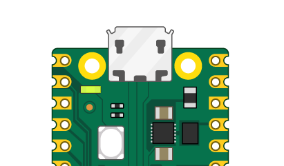

## Använd Shell

I det här steget kommer du att använda Thonny Shell för att köra lite enkel Python-kod på din Raspberry Pi Pico.

\--- task ---

Se till att din Raspberry Pi Pico är ansluten till din dator och att du har valt MicroPython (Raspberry Pi Pico)-tolken.

\--- /task ---

\--- task ---

Titta på Shell-panelen längst ned i Thonny-redigeraren.

Det borde se ut ungefär så här:


Thonny kan nu kommunicera med din Raspberry Pi Pico med hjälp av REPL (read–eval–print loop), som låter dig skriva Python-kod i Shell och se resultatet.

\--- /task ---

\--- task ---

Nu kan du skriva kommandon direkt i skalet och de kommer att köras på din Raspberry Pi Pico.

Skriv följande kommando.

```python
print("Hello")
```

Tryck på Enter-tangenten så ser du resultatet:


\--- /task ---

\--- task ---

MicroPython lägger till hårdvaruspecifika moduler, som "maskin", som du kan använda för att programmera din Raspberry Pi Pico.

Vi skapar ett `machine.Pin`-objekt för att motsvara den inbyggda lysdioden, som kan nås med GPIO pin 25.

Om du ställer in värdet på lysdioden (LED) till "1", tänds den.

Vi skapar ett `machine.Pin`-objekt för att motsvara den inbyggda lysdioden (LED), som kan nås med GPIO pin 25.

```python
from machine import Pin
led = Pin(25, Pin.OUT)
led.value(1)
```

Du bör se den inbyggda Lysdioden lysa.



Skriv in koden för att ställa in värdet på "0" för att stänga av lysdioden.

```python
led.value(0)
```

Slå på och av lysdioden så många gånger du vill.

**Tips:** Du kan använda uppåtpilen på tangentbordet för att snabbt komma åt tidigare rader.

\--- /task ---

Om du vill skriva ett längre program är det bäst att spara det i en fil. Du kommer att göra detta i nästa steg.
