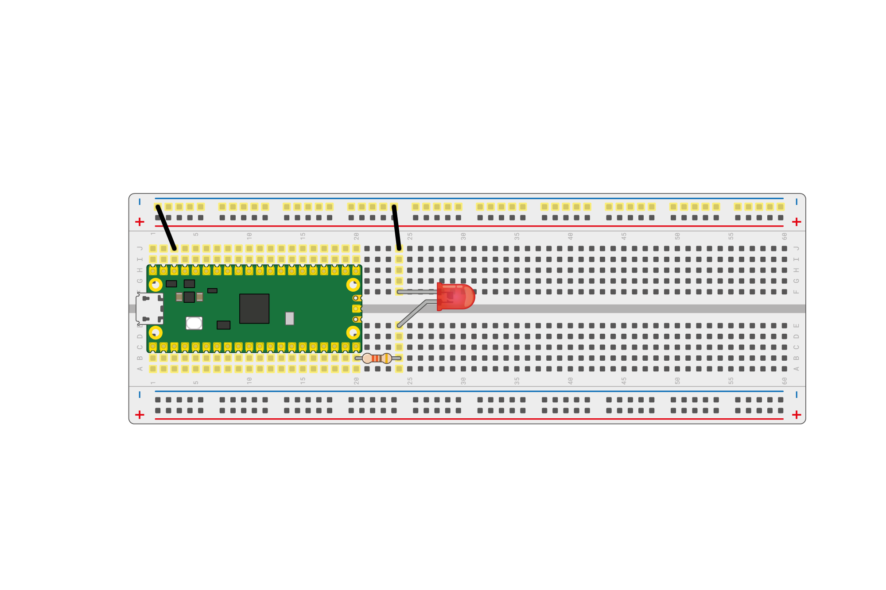
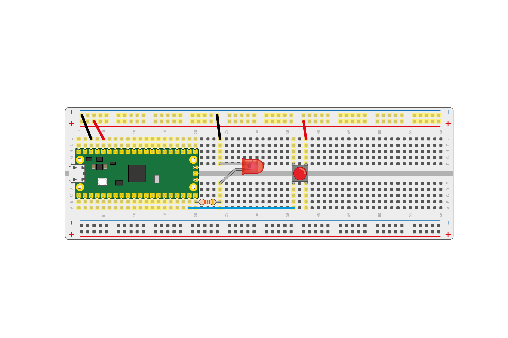

## Använd digitala in- och utgångar

Nu när du kan grunderna, så kan du lära dig att styra en extern lysdiod med din Raspberry Pi Pico, och få den att läsa indata från en knapp.

\--- task ---

Använd ett motstånd mellan cirka 50 och 330 ohm, en lysdiod och ett par M-M bygelkablar för att ansluta din Raspberry Pi Pico som visas i bilden nedan.



\--- /task ---

I det här exemplet är lysdioden ansluten till stift 15. Om du använder en annan pin, kom ihåg att slå upp numret i pinout-diagrammet i [Meet Raspberry Pi Pico-sektionen](1.html).

\--- task ---

Använd samma kod som du gjorde för att blinka den inbyggda lysdioden, men ändra pinnumret till `15`.

```python
from machine import Pin, Timer
led = Pin(15, Pin.OUT)
timer = Timer()

def blink(timer):
    led.toggle()
	
timer.init(freq=2.5, mode=Timer.PERIODIC, callback=blink)
```

\--- /task ---

Kör ditt program och din lysdiod bör börja blinka. Om det inte fungerar, kontrollera dina kablar för att vara säker på att lysdioden är korrekt ansluten.

Låt oss sedan försöka styra lysdioden med en knapp.

\--- task ---

Lägg till en knapp till din krets som visas i diagrammet nedan.



\--- /task ---

Knappen sitter på stift 14 och är ansluten till 3,3V stiftet på din Raspberry Pi Pico. Det betyder att när du ställer in stiftet måste du tala om för MicroPython att det är ett ingångsstift och måste _tryckas ner_.

\--- task ---

Skapa en ny fil och lägg till denna kod.

```python
from machine import Pin
import time

led = Pin(15, Pin.OUT)
button = Pin(14, Pin.IN, Pin.PULL_DOWN)

while True:
    if button.value():
	    led.toggle()
        time.sleep(0.5)
```

\--- /task ---

\--- task ---

Kör din kod och när du trycker på knappen ska lysdioden slås på eller av. Om du håller ner knappen kommer den att blinka.

\--- /task ---

\--- save ---
