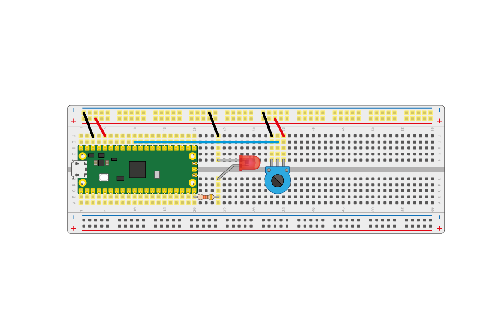

## Styr en lysdiod med en analog ingång

Din Raspberry Pi Pico har ingångsstift som kan ta emot analoga signaler. Detta innebär att istället för att bara läsa värdena `1` och `0` (på och av), kan den läsa värden däremellan.

En potentiometer är den perfekta analoga enheten för denna aktivitet.

--- task ---

Byt ut knappen i din krets med en potentiometer. Följ kopplingsschemat nedan för att ansluta den till ett analogt stift.



--- /task ---

--- task ---

I en ny fil i Thonny kan du först läsa av potentiometerns motstånd.

Lägg till den här koden i en ny fil och kör den sedan.

```python
from machine import ADC, Pin
import time

adc = ADC(Pin(26))

while True:
    print(adc.read_u16())
    time.sleep(1)
```

Vrid potentiometern för att se dens största och lägsta värde.

Värdet bör vara ungefär mellan `0` och `65025`.

--- /task ---

--- task ---

Du kan nu använda detta värde för att styra arbetscykeln för PWM (Pulsvariation) på lysdioden.

Ändra koden till följande. När du har startat den, ställ in ratten på potentiometern för att kontrollera lysdiodens ljusstyrka.

```python
from machine import Pin, PWM, ADC

pwm = PWM(Pin(15))
adc = ADC(Pin(26))

pwm.freq(1000)

while True:
	duty = adc.read_u16()
	pwm.duty_u16(duty)
```

--- /task ---

--- save ---
