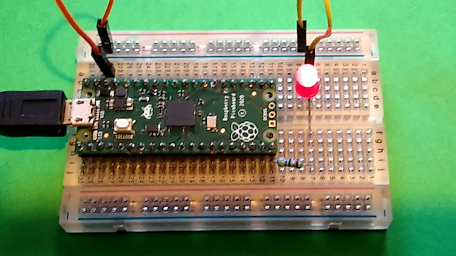

## 导言

在这个项目中，您将把 Raspberry Pi Pico 连接到另一台计算机，并学习如何使用 MicroPython 进行编程。

Raspberry Pi Pico是一款低成本的微控制器设备。 微控制器是微型计算机，但它们往往缺乏大容量存储和外围设备（例如，键盘或显示器）。 微控制器是微型计算机，但它们往往缺乏大容量存储和外围设备（例如，键盘或显示器）。

Raspberry Pi Pico 具有 GPIO 引脚，很像树莓派计算机，这意味着它可以用来控制和接收来自各种电子设备的输入。

[**新的 Raspberry Pi Pico 入门课程**](https://projects.raspberrypi.org/zh-CN/pathways/pico-intro) 使用 [picozero](https://picozero.readthedocs.io/zh-CN/latest/) 包进行一些创意物理计算项目。

### 您将制作什么

您将把一个 Raspberry Pi Pico 连接到您的电脑，安装 Thonny Python IDE，并编写一个 MicroPython 程序来让板载 LED 闪烁。 如果您有额外的组件，那么您也可以尝试一些其他的例子。 如果您有额外的组件，那么您也可以尝试一些其他的例子。

\--- no-print ---

\--- /no-print ---

\--- print-only ---

\--- /print-only ---

## --- collapse ---

## title: 您将需要

### 硬件

- 一个焊接了排针的 Raspberry Pi Pico
- 一台可以运行 Thonny IDE 并对 Raspberry Pi Pico 编程的计算机
- 一根 micro USB 数据线
- 一些电子元件，比如一个按钮、一个带合适电阻的LED灯以及一个的电位器（可选）
- 面包板和公对公跳线用于连接额外的组件（可选）
- 一个5V micro USB电源（可选）

### 软件

该项目将指导您完成以下内容的安装：

- 适用于 Raspberry Pi Pico 的 MicroPython固件
- Thonny Python IDE

\--- /collapse ---

## --- collapse ---

## title: 你将学到

- 如何将 MicroPython 固件加载到 Raspberry Pi Pico 上
- 如何使用 MicroPython 编程 Raspberry Pi Pico
- 如何将额外的组件连接到 Raspberry Pi Pico 并编写 MicroPython 程序与它们交互

\--- /collapse ---

## --- collapse ---

## title: 为教育者提供的额外信息

如果您在学校或其他受管理环境中完成这个项目，那么您应确保您有挂载 USB 驱动器和安装软件的适当权限。

如果您需要打印这个项目，请使用[适合打印的版本](https://projects.raspberrypi.org/zh-CN/projects/getting-started-with-the-pico/print){:target="_blank"}。

[这里是此项目已完成脚本的链接](https://rpf.io/p/zh-CN/getting-started-with-the-pico-get)。

\--- /collapse ---
