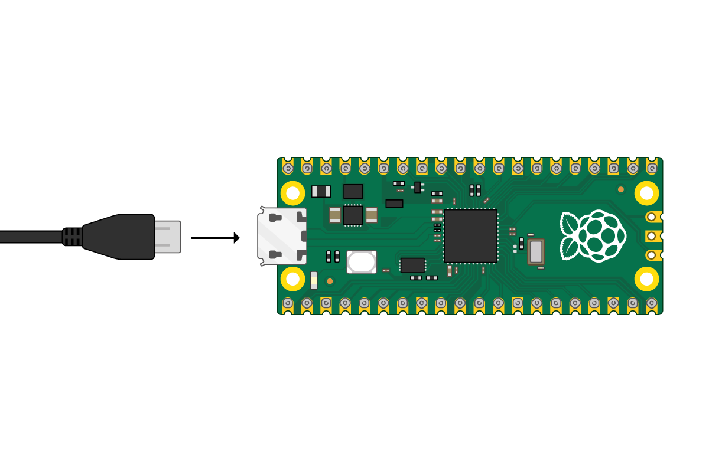

## 认识 Raspberry Pi Pico

这是一个 Raspberry Pi Pico。 希望你的设备已经焊上了排针，如果还没有，你可能想看看我们的[焊接入门资源](https://projects.raspberrypi.org/zh-CN/projects/getting-started-with-soldering)。

--- task ---

如果你有一个面包板，请将你的 Raspberry Pi Pico放在板子上。

放置它时要确保两个排针之间隔着中间的裂缝。

--- /task ---

--- task ---

将 micro USB 线插入主板左侧的端口。

--- /task ---

如果你想知道树莓派Pico的引脚编号，可以参考下面的图表。

