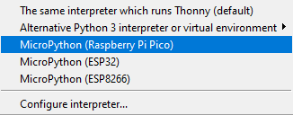

## 添加 MicroPython 固件

如果您从未在 Raspberry Pi Pico 上使用过 MicroPython，您需要添加 MicroPython 固件。

\--- task ---

在你的 Raspberry Pi Pico 上找到 BOOTSEL 按钮。

按下 BOOTSEL 按钮并保持，同时将 micro USB 数据线的另一端连接到你的电脑。 下面的图片展示了一个树莓派，但同样适用于任何电脑。

这会将你的 Raspberry Pi Pico 置于USB大容量存储设备模式。

\--- /task ---

\--- task ---

在 Thonny 窗口的右下角，你会看到你当前正在使用的 Python 版本。

点击 Python 版本，然后选择'MicroPython (Raspberry Pi Pico)'：

如果你没有看到这个选项，请检查你的 Raspberry Pi Pico是否已经插好。

\--- /task ---

\--- task ---

将弹出一个对话框，以安装最新版本的 MicroPython 固件到你的 Raspberry Pi Pico 上。

点击 **安装** 按钮将固件复制到你的 Raspberry Pi Pico。

等待安装完成后点击 **关闭**。

\--- /task ---

\--- collapse ---

***

title: 固件安装菜单

***

你也可以点击状态栏中的 “MicroPython（Raspberry Pi Pico）” 并选择 “配置解释器” 来访问固件安装菜单。

解释器设置将打开。

点击 **安装或更新MicroPython**

你将被提示在按住BOOTSEL按钮的同时连接您的 Raspberry Pi Pico。

然后你可以点击 **安装**。

等待安装完成后点击 **关闭**。

\--- /collapse ---

你不需要每次使用 Raspberry Pi Pico 时都更新固件。 下次，你只需将其插入电脑，无需按 BOOTSEL 按钮。
