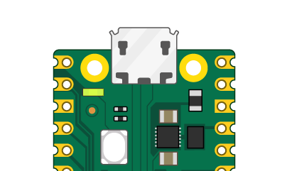

## 使用 Shell

在这一步中，你将使用 Thonny Shell 在你的 Raspberry Pi Pico 上运行一些简单的 Python 代码。

--- task ---

请确保你的 Raspberry Pi Pico 已经连接到你的计算机，并且你已经选择了 MicroPython（Raspberry Pi Pico）解释器。

--- /task ---

--- task ---

请查看 Thonny 编辑器底部的 Shell 面板。

你应该会看到类似这样的东西：


Thonny 现在能够通过 REPL（读取-求值-打印循环）与您的 Raspberry Pi Pico 通信，这允许您在 Shell 中输入 Python 代码并查看输出。

--- /task ---

--- task ---

现在你可以直接在Shell中输入命令，它们将在你的 Raspberry Pi Pico 上运行。

输入以下命令。

```python
print("Hello")
```

按下回车键，你将看到输出结果：


--- /task ---

--- task ---

MicroPython 为硬件添加了特定模块，例如 `machine`，你可以使用它来为你的 Raspberry Pi Pico 编程。

让我们创建一个 `machine.Pin` 对象来对应开发板上的 LED 灯，该 LED 可以通过 GPIO 引脚 25 访问。

如果你将LED的值设置为 `1`，它会亮起来。

输入以下代码，确保在每行后按回车键。

```python
from machine import Pin
led = Pin(25, Pin.OUT)
led.value(1)
```

你应该会看到板载 LED 灯亮起。



输入代码将值设置为 `0` 来关闭 LED 灯。

```python
led.value(0)
```

你可以通过上述方式随意打开和关闭LED灯。

**提示：** 你可以使用键盘上的上箭头快速访问之前的代码。

--- /task ---

如果你想写一个较长的程序，那么最好将其保存在一个文件中。 接下来你会进行这一步。
