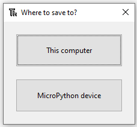

## 让板载 LED 闪烁

Shell 很有用，可以确保一切正常运行并且试验快速命令。 然而，将较长的程序放在文件中会更好。 然而，将较长的程序放在文件中会更好。

Thonny 可以直接在你的 Raspberry Pi Pico 上保存和运行 MicroPython 程序。

在这一步中，您将创建一个 MicroPython 程序，以循环方式让板载 LED 闪烁。

\--- task ---

在Thonny的主编辑区域点击。

输入以下代码以切换LED（开关状态）。

```python
from machine import Pin
led = Pin(25, Pin.OUT)

led.toggle()
```

\--- /task ---

\--- task ---

点击 **运行** 按钮来运行你的代码。

Thonny 会询问你是想将文件保存在 **这台计算机** 上还是 **MicroPython 设备** 上。 选择 **MicroPython 设备**。 选择 **MicroPython 设备**。



输入 `blink.py` 作为文件名。

**提示：** 您需要输入 `.py` 文件扩展名，以便 Thonny 识别该文件为 Python 文件。

Thonny 能将你的程序保存到你的 Raspberry Pi Pico 上并运行它。

每次单击 **运行** 按钮时，你都应该能看到板载 LED 在打开和关闭之间切换。

\--- /task ---

\--- task ---

你可以使用 `Timer` 模块来设置一个定时器，以固定间隔运行一个函数。

调整你的代码让它看起来像这样：

```python
from machine import Pin, Timer
led = Pin(25, Pin.OUT)
timer = Timer()

def blink(timer):
    led.toggle()

timer.init(freq=2.5, mode=Timer.PERIODIC, callback=blink)
```

点击 **运行**，你的程序会让 LED 灯开关闪烁，直到你点击停止按钮。

\--- /task ---

\--- save ---
