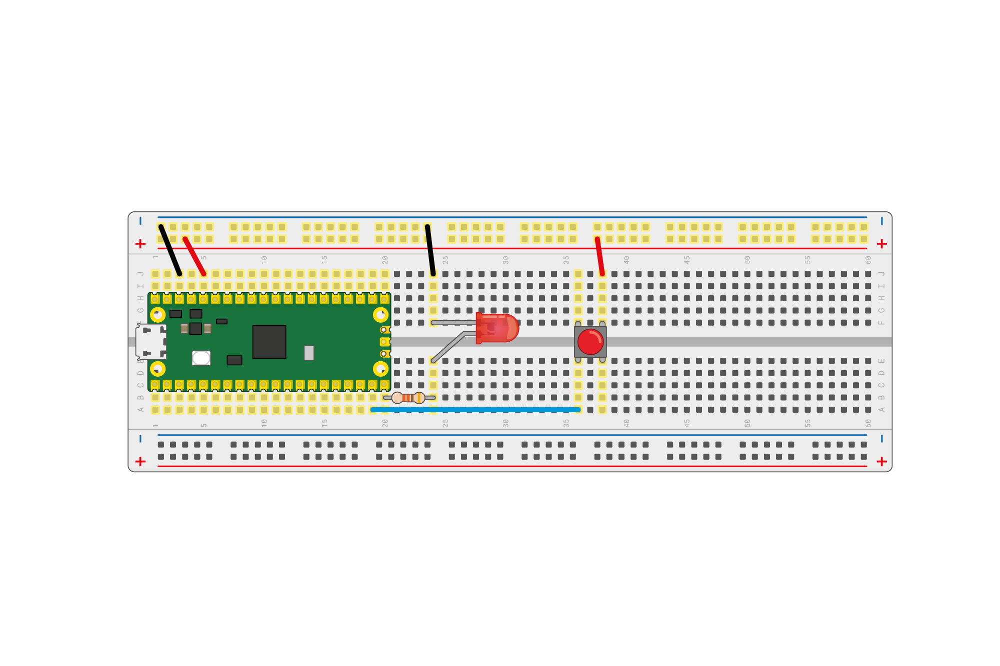

## 使用数字输入和输出

现在你已经掌握了基础知识，你可以学习如何用你的 Raspberry Pi Pico 来控制一个外部的 LED 灯，并且让它读取按钮的输入。

--- task ---

使用一个大约50到330欧姆的电阻、一个LED以及一对公对公跳线，按照下图连接你的 Raspberry Pi Pico。


--- /task ---

在这个例子中，LED 连接到15号引脚。 如果你使用其他引脚，请记得在 [认识 Raspberry Pi Pico 部分](1.html) 部分的引脚图中查找对应的编号。

--- task ---

使用和你之前让板载 LED 闪烁相同的代码，但是将引脚号改为 `15`。

```python
from machine import Pin, Timer
led = Pin(15, Pin.OUT)
timer = Timer()

def blink(timer):
    led.toggle()
	
timer.init(freq=2.5, mode=Timer.PERIODIC, callback=blink)
```

--- /task ---

运行你的程序，你的LED灯应该会开始闪烁。 如果它没有工作，请检查你的线路确保 LED 灯已经连接好。

接下来，让我们尝试使用按钮来控制 LED 。

--- task ---

如下图所示，在你的电路中添加一个按钮。



--- /task ---

按钮连接在引脚 `14` 上，并且与你的 Raspberry Pi Pico 上的3.3V引脚相连。 这意味着当你设置这个引脚时，你需要告诉MicroPython它是一个输入引脚，并且需要被下拉。

--- task ---

创建一个新文件并添加这段代码。

```python
from machine import Pin
import time

led = Pin(15, Pin.OUT)
button = Pin(14, Pin.IN, Pin.PULL_DOWN)

while True:
    if button.value():
	    led.toggle()
        time.sleep(0.5)
```

--- /task ---

--- task ---

运行你的代码，当你按下按钮时，LED 灯应该会在开和关之间切换。 如果你长按按钮，它会闪烁。

--- /task ---

--- save ---
